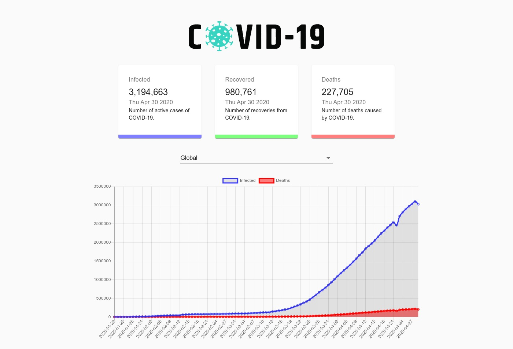
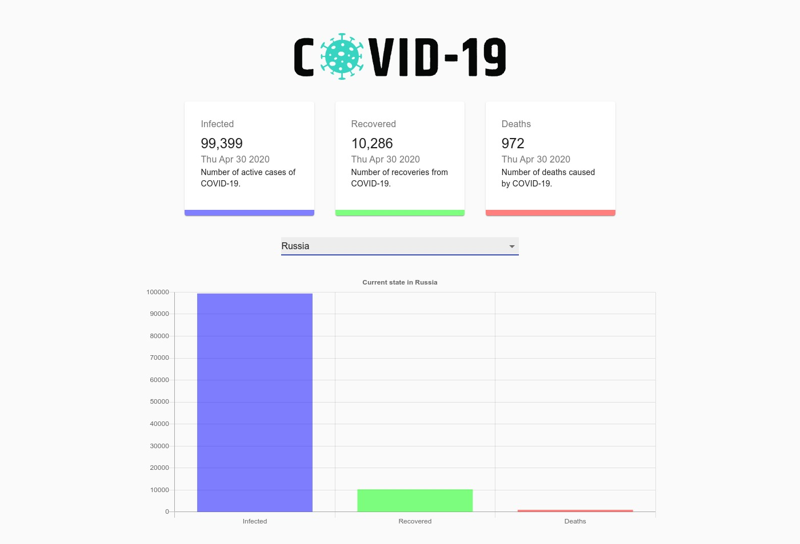

## React COVID-19 statistic

This project was bootstrapped with [Create React App](https://github.com/facebook/create-react-app).

### Install

* To start a project, you must set up all npm dependent commands.
> npm install

* All settings save to `.env.local`

### .env.local

* REACT_APP_API_ADDRESS - address to api with data 
 

### Available Scripts

In the project directory, you can run:
> `npm run start`

Runs the app in the development mode. 
Open [http://localhost:3000](http://localhost:3000) to view it in the browser.

### Built With

* [material-ui](https://github.com/mui-org/material-ui) - React components for faster and easier web development style template
* [chart.js](https://www.chartjs.org/) - flexible JavaScript charting
* [react-chartjs-2](https://github.com/jerairrest/react-chartjs-2) - React wrapper for Chart.js
* [react-countup](https://github.com/glennreyes/react-countup) - quickly create animations that display numerical data
* [gh-pages](https://pages.github.com/) - create a new repository with a live page on GitHub
* [icons8.com](https://icons8.com/cssload/) - spinner for data loader
* [kapwing.com/404](https://www.kapwing.com/404-illustrations?ref=producthunt) - error page example
* [i18next](https://www.i18next.com/) - internationalization

