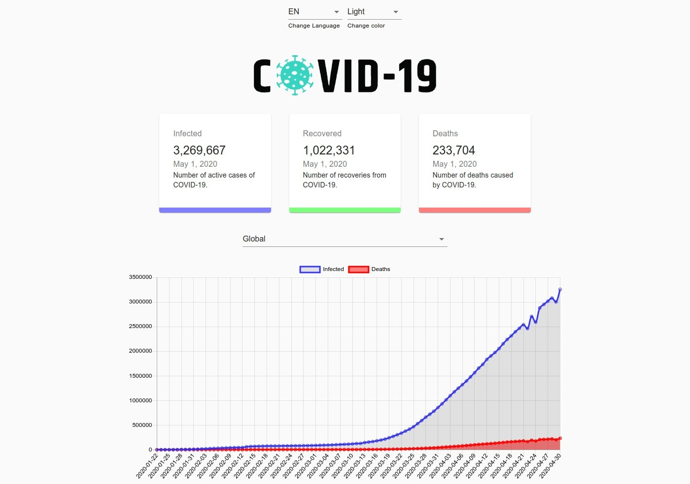
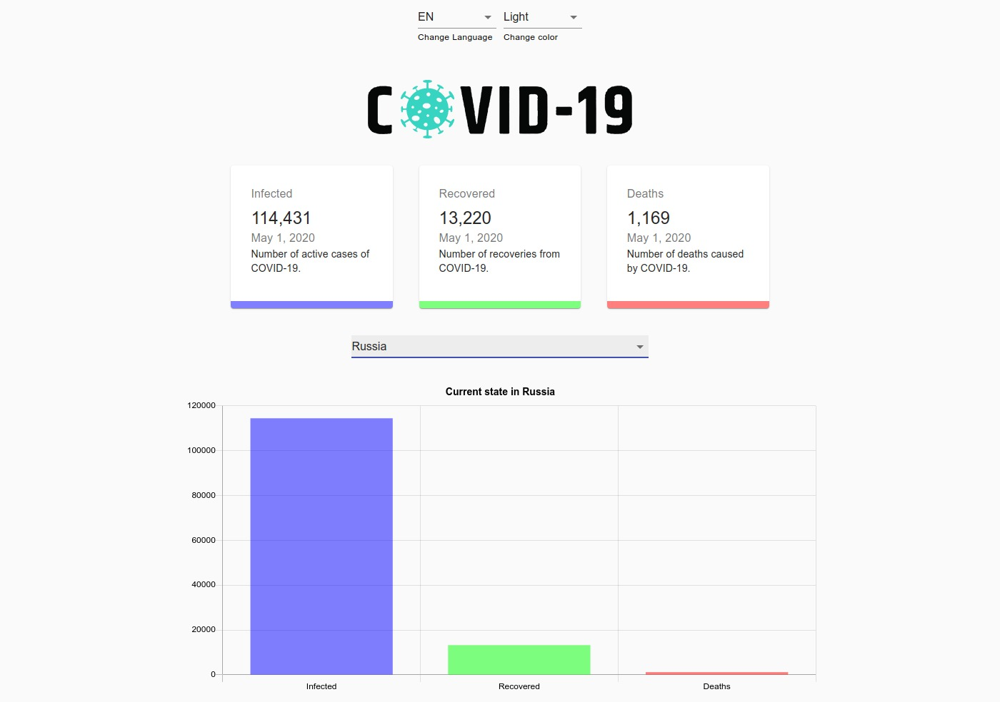
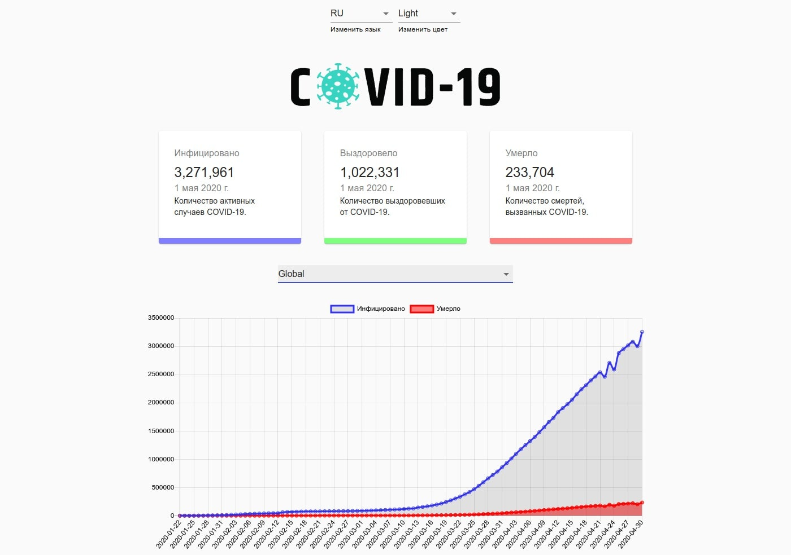
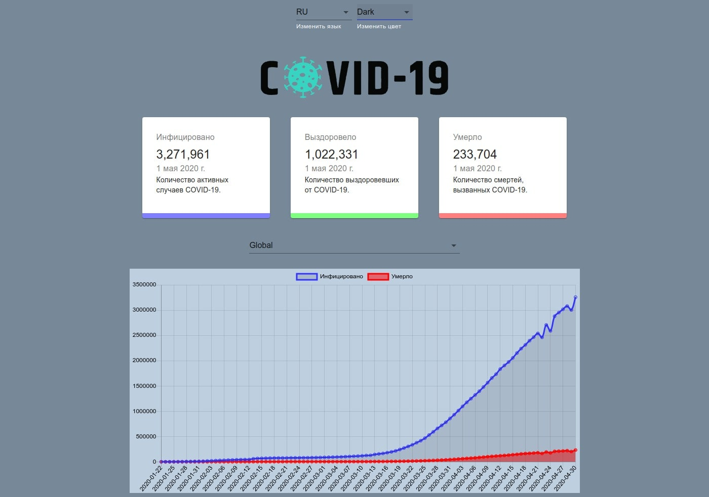

## React COVID-19 statistic

This project was bootstrapped with [Create React App](https://github.com/facebook/create-react-app).

This project is made on React. Displays disease statistics from COVID-19 in graphs. There is a change of languages ​​to ru / en and a change in the theme of design to light and dark. Settings are saved in localStorage

### Install

`npm install` To start a project, you must set up all npm dependent commands.

* All settings save to `.env.local`

### .env.local

* REACT_APP_API_ADDRESS - address to api with data 
* REACT_APP_LOCAL_STORAGE_NAME - localStorage name for save settings
 

### Available Scripts

* `npm run start` - start project
* `npm run test` - test running

Runs the app in the development mode. 
Open [http://localhost:3000](http://localhost:3000) to view it in the browser.

### Built With

* [material-ui](https://github.com/mui-org/material-ui) - React components for faster and easier web development style template
* [chart.js](https://www.chartjs.org/) - flexible JavaScript charting
* [react-chartjs-2](https://github.com/jerairrest/react-chartjs-2) - React wrapper for Chart.js
* [react-countup](https://github.com/glennreyes/react-countup) - quickly create animations that display numerical data
* [gh-pages](https://pages.github.com/) - create a new repository with a live page on GitHub
* [icons8.com](https://icons8.com/cssload/) - spinner for data loader
* [kapwing.com/404](https://www.kapwing.com/404-illustrations?ref=producthunt) - error page example
* [i18next](https://www.i18next.com/) - internationalization
* [jest-canvas-mock](https://github.com/hustcc/jest-canvas-mock) - mock canvas when run unit test cases with jest.
* [coveralls](https://github.com/nickmerwin/node-coveralls) - coverage reporting of [coveralls.io](https://coveralls.io/) and add a cool coverage button

